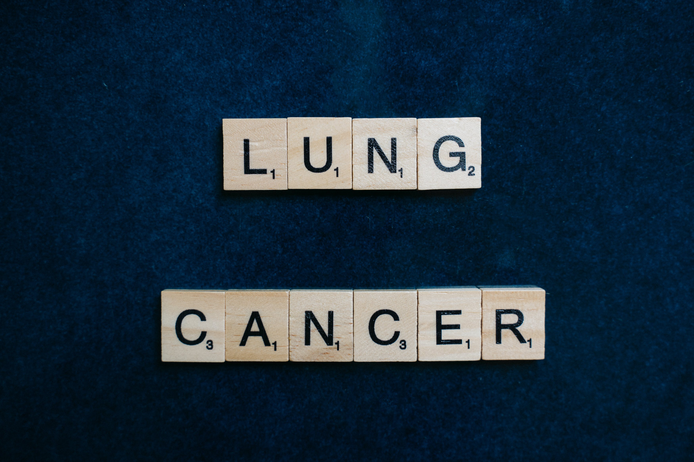

# Lung Cancer

I've tried to analyze the data of the lung cancer patient's data.

## Attribute Information

| COLUMNS               | VALUES             |
| --------------------- | ------------------ |
| GENDER                | M(MALE), F(FEMALE) |
| AGE                   | Age of the patient |
| SMOKING               | YES=2, NO=1        |
| YELLOW_FINGERS        | YES=2, NO=1        |
| ANXIETY               | YES=2, NO=1        |
| PEER_PRESSURE         | YES=2, NO=1        |
| CHRONIC DISEASE       | YES=2, NO=1        |
| FATIGUE               | YES=2, NO=1        |
| ALLERGY               | YES=2, NO=1        |
| WHEEZING              | YES=2, NO=1        |
| ALCOHOL CONSUMING     | YES=2, NO=1        |
| COUGHING              | YES=2, NO=1        |
| SHORTNESS OF BREATH   | YES=2, NO=1        |
| SWALLOWING DIFFICULTY | YES=2, NO=1        |
| CHEST PAIN            | YES=2, NO=1        |
| LUNG_CANCER           | YES, NO            |

## Findings

1. **Basic Data Exploration:**

- How many rows and columns are there in the dataset?
- What are the data types of each column?
- Are there any missing values in the dataset?

2. **Gender Distribution:**

- What is the distribution of gender in the dataset?
- How many male (M) and female (F) patients are there?

3. **Age Analysis:**

- What is the average age of the patients?
- What is the age range of the patients in the dataset?

4. **Smoking Habits:**

- What percentage of patients are smokers?
- Among smokers, what is the average age?

5. **Symptoms Analysis:**

- How many patients experience anxiety?
- What is the most common symptom among the patients?

6. **Health Conditions:**

- How many patients have chronic diseases?
- What is the distribution of fatigue among the patients?

7. **Lung Cancer Cases:**

- How many patients have been diagnosed with lung cancer?
- Is there a correlation between smoking and lung cancer?

8. **Alcohol Consumption:**

- What percentage of patients consume alcohol?
- Among alcohol consumers, what is the prevalence of wheezing?

9. **Chest Pain Analysis:**

- How many patients experience chest pain?
- Is there a relationship between chest pain and shortness of breath?

10. **Peer Pressure and Smoking:**

- Among patients who experience peer pressure, what percentage are smokers?
- Is there a difference in the average age between smokers and non-smokers?
